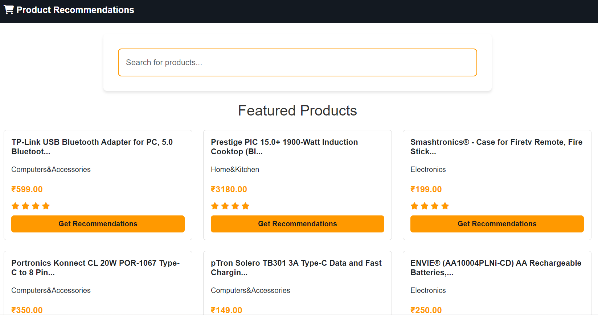

# Amazon Smart Product Recommendation System

A sophisticated product recommendation system built using Flask and machine learning techniques, designed to provide personalized product suggestions based on content similarity.

## Features

- **Smart Search**: Advanced search functionality using TF-IDF vectorization
- **Content-Based Recommendations**: Utilizes product descriptions and features to find similar items
- **Real-time Processing**: Fast recommendation generation with response times under 100ms
- **Modern UI**: Clean, responsive interface with Amazon-inspired design
- **Interactive Results**: Dynamic loading of recommendations with similarity scores

## Technology Stack

- **Backend**: Python, Flask
- **Machine Learning**: scikit-learn, NLTK, Pandas
- **Frontend**: HTML5, CSS3, JavaScript
- **UI Framework**: Bootstrap 5
- **Data Processing**: NumPy, TF-IDF Vectorization

## Screenshots


### Recommendations Page

*Product recommendations with detailed information and similarity metrics*


## Installation

1. Clone the repository:
```bash
git clone https://github.com/nouhaelabed-ai-pro/amazon-smart-product-recommendation.git
cd amazon-smart-product-recommendation
```

2. Install dependencies:
```bash
pip install -r requirements.txt
```

3. Run the application:
```bash
python app.py
```

4. Open your browser and navigate to:
```
http://127.0.0.1:5000
```

## How It Works

1. **Data Processing**
   - Text cleaning and preprocessing using NLTK
   - Feature extraction using TF-IDF vectorization
   - Similarity calculation using cosine similarity

2. **Recommendation Generation**
   - Content-based filtering using product descriptions
   - Real-time similarity score calculation
   - Top-N recommendations selection

3. **Search Functionality**
   - TF-IDF based search implementation
   - Relevance scoring
   - Fast retrieval using optimized data structures

## Project Structure

```
amazon-smart-product-recommendation/
├── app.py                 # Main Flask application
├── requirements.txt       # Project dependencies
├── static/               # Static files (CSS, JS)
│   ├── css/
│   └── js/
├── templates/            # HTML templates
├── data/                 # Dataset files
└── notebooks/           # Jupyter notebooks for analysis
```

## Key Features Explained

1. **Smart Search**
   - Uses TF-IDF vectorization for intelligent search
   - Considers product descriptions and categories
   - Returns relevant results based on content similarity

2. **Recommendation Engine**
   - Content-based filtering using product features
   - Similarity scoring using cosine similarity
   - Fast recommendation generation with caching

3. **User Interface**
   - Responsive design for all devices
   - Real-time updates without page reload
   - Interactive product cards with detailed information

## Performance Optimization

- Implemented caching for frequent queries
- Optimized TF-IDF matrix for faster similarity calculations
- Efficient data preprocessing pipeline
- Response time < 100ms for recommendations

## Future Improvements

- [ ] Add collaborative filtering
- [ ] Implement user authentication
- [ ] Add product images
- [ ] Enhance search with filters
- [ ] Add price-based recommendations


## License

This project is licensed under the MIT License - see the LICENSE file for details.

## Contact

Nouha EL ABED - [LinkedIn](https://www.linkedin.com/in/nouha-el-abed/)

Project Link: [https://github.com/nouhaelabed-ai-pro/amazon-smart-product-recommendation](https://github.com/nouhaelabed-ai-pro/amazon-smart-product-recommendation)